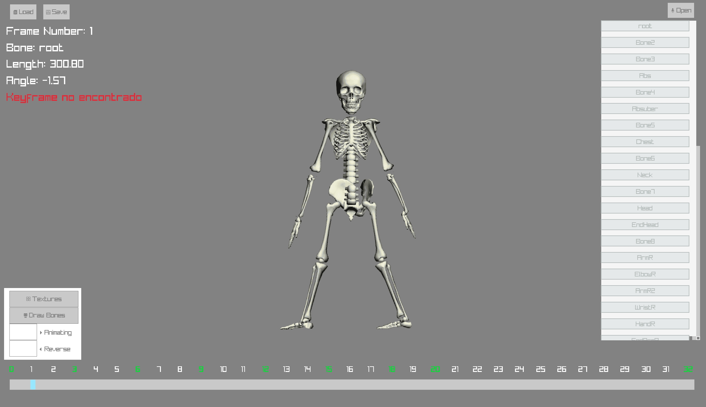

# RayPuppet-Animator

<p align="center">
  
</p>
## Description

**RayPuppet-Animator** is a bone animation system that allows for the manipulation and animation of skeletal models. It uses both 2D and 3D graphics, enabling users to interact with bones and apply animations in real-time. It includes a graphical interface that simplifies texture selection, layer configuration, and keyframe management.

## Features

- **Graphical Interface:** Allows users to interact with bones and textures.
- **Real-time Animation:** Plays animations forward and backward.
- **Texture Management:** Enables texture selection and application to bones.
- **Keyframe Control:** Facilitates the setting of keyframes at different moments in the animation.

## Requirements

- [raylib](https://www.raylib.com/) - Graphics library used in the project.
- C/C++ compiler (such as GCC or Clang).

## Installation

1. Clone the repository:

   ```
   git clone https://github.com/your_username/RayPuppet-Animator.git 
2. Navigate to the project directory:
   
   ```
   cd RayPuppet-Animator
3. Build the project using make:
   ```
   make

## Usage

To run the bone animation system, simply execute the following command from the project directory: 
   ```
  ./bones
```
## Controls

1. **Animating**: Play the animation forward.
2. **Reverse**: Play the animation backward.
3. **Draw Bones**: Toggle the visibility of bones on or off.
4. **Textures / Animation**: One mode allows for animation playback, while another mode focuses on texture/layer modification.
5. **Slider**: Use the slider to animate the model dynamically.
6. **Bone Selector**: Select different bones to manipulate or animate.
7. **Save Animation**: Button is available to save animations.
8. **Load Animation**: Button allows loading previously saved animations.
9. **Open New Meshes**: Use this option to open new mesh files, though this feature is still experiencing some issues.


## Contributions

This project is in its early stages and still has some issues, but I would love to hear your thoughts on it! If you would like to contribute, please follow these steps:

1. Fork the project.
2. Create a new branch (`git checkout -b feature/new-feature`).
3. Make your changes and commit them (`git commit -m 'Added new feature'`).
4. Push to your branch (`git push origin feature/new-feature`).
5. Open a Pull Request.


## Contact

If you have any questions or comments, feel free to reach out to me at vberdugo@student.42barcelona.com.

Let me know if you need any more adjustments!
